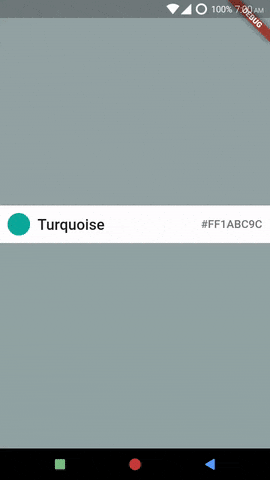

# Creating A SelectionMenu
*Example: 1_basic_01*

## Code Highlights

```dart
import 'package:selection_menu/selection_menu.dart';

List<FlatColor> colors = FlatColors.colors;

SelectionMenu<FlatColor>(
  itemsList: colors,
  // A list of items to choose from.

  itemBuilder: this.itemBuilder,
  // A callback to return a widget created from an Item (type FlatColor in this example.)

  onItemSelected: this.onItemSelected,
  // A callback for when an item is selected.
  
  // Other properties...
);
```

For complete code, explained with details, see [main.dart](./main.dart).
## Result



