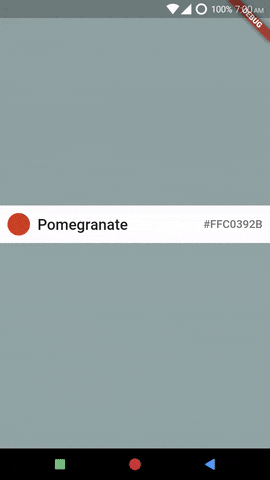

# Adding A SearchBar
*Example: 1_basic_02*

## Code Highlights

```dart
import 'package:selection_menu/selection_menu.dart';

 SelectionMenu<FlatColor>(
  itemSearchMatcher: itemSearchMatcherCallback,
  // Defaults to null, meaning search is disabled.
  // ItemSearchMatcher takes a searchString and an Item (FontColor in this example)
  // Returns true if searchString can be used to describe Item, else false.

  searchLatency: Duration(seconds: 1),
  // Defaults to const Duration(milliseconds: 500).
  // This is the delay before the SelectionMenu actually starts searching.
  // Since search is called for every character change in the search field,
  // it acts as a buffering time and does not perform search for every
  // character update during this time.

  // Other properties...
);
```

For complete code, explained with details, see [main.dart](./main.dart).
## Result



