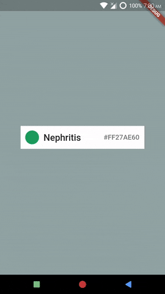

# Durations of Animation
*Example: 1_basic_04*

## Code Highlights

```dart
import 'package:selection_menu/selection_menu.dart';
import 'package:selection_menu/components_configurations.dart';

SelectionMenu<FlatColor>(
    // ComponentsConfiguration is the core of the high customizability
    // this Widget provides.
    //
    // The default ComponentsConfiguration is DialogComponentsConfiguration.
    // A second one, and the only other provided predefined so far, is
    // DropdownComponentsConfiguration, which displays a dropdown style
    // menu.
    componentsConfiguration: DialogComponentsConfiguration(
        // Animations can be created and controlled by 
        // ComponentsConfiguration.animationComponent.
        // This will be demonstrated in later examples.

        menuAnimationDurations: MenuAnimationDurations(
          forward: const Duration(seconds: 2),
          // Menu opening animation duration.
          reverse: const Duration(seconds: 2),
          // Menu closing animation duration.
        ),
        //
        // ComponentsConfiguration take a MenuSizeConfiguration too.
        // If you are providing a ComponentsConfiguration and a 
        // MenuSizeConfiguration,
        // you must provide the size configuration inside the 
        // ComponentsConfiguration.
        menuSizeConfiguration: MenuSizeConfiguration(
          // Properties
        ),
     ),
    // Other properties.
  );
```

For complete code, explained with details, see [main.dart](./main.dart).
## Result



