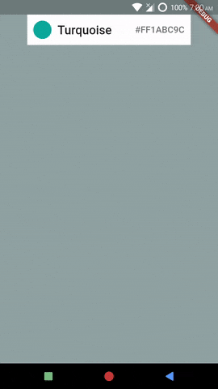

# Using Different ComponentsConfigurations
*Example: 1_basic_05*

<!-- TODO add reference to docs -->

## Code Highlights

```dart
import 'package:selection_menu/selection_menu.dart';
import 'package:selection_menu/components_configurations.dart';

SelectionMenu<FlatColor>(
    componentsConfiguration: DropdownComponentsConfiguration<FlatColor>(
      // Overriding specific default behavior will be demonstrated in 
      // later examples.
    ),
    // Other properties...
  );
```

For complete code, explained with details, see [main.dart](./main.dart).
## Result



