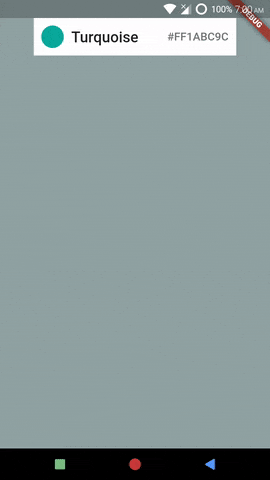

# Menu Flex Values
*Example: 1_basic_06*

<!-- TODO add reference to docs -->

## Code Highlights

```dart
import 'package:selection_menu/selection_menu.dart';
import 'package:selection_menu/components_configurations.dart';

SelectionMenu<FlatColor>(
        componentsConfiguration: DropdownComponentsConfiguration<FlatColor>(
          // MenuFlexValues are the Flex values of each component of the menu.
          // These values help size things relatively. So that if menu size is
          // changed, the appearance tries to stay consistent.
          //
          // Read more details in main.dart or API docs.
          menuFlexValues: MenuFlexValues(
            searchingIndicator: 1,
            searchBar: 1,
            listView: 1,
            searchField: 1,
          ),
          // Other configurations...
        ),
        // Other Properties.
      );
```

For complete code, explained with details, see [main.dart](./main.dart).
## Result



