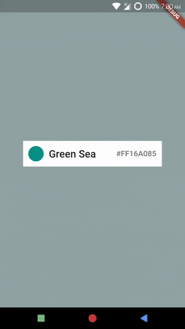

# Mixing or Sharing Configurations
*Example: 1_basic_07*

<!-- TODO add reference to docs -->

## Code Highlights

```dart
import 'package:selection_menu/selection_menu.dart';
import 'package:selection_menu/components_configurations.dart';

SelectionMenu<FlatColor>(
    componentsConfiguration: DropdownComponentsConfiguration<FlatColor>(
      // You can override predefined components by passing new ones in the
      // constructor like this.
      //
      // DialogAnimationComponent comes with DialogComponentsConfiguration
      // all components are available for you to replace.
      animationComponent: DialogAnimationComponent(),
      menuSizeConfiguration:
          DialogComponentsConfiguration.defaultMenuSizeConfiguration,
    ) // or you can use the copyWith method
    .copyWith(
        menuPositionAndSizeComponent:
            DialogMenuPositionAndSizeComponent()
            ),
     // Other Properties...
  );
```

For complete code, explained with details, see [main.dart](./main.dart).
## Result



