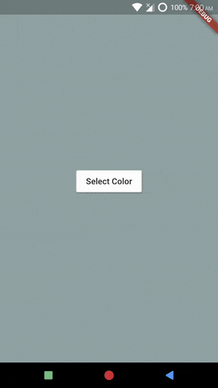

# TriggerComponent and TriggerFromItemComponent
*Example: 2_intermediate_01*

<!-- TODO add reference to docs -->


## Code Highlights

```dart
import 'package:selection_menu/selection_menu.dart';
import 'package:selection_menu/components_configurations.dart';

SelectionMenu<FlatColor>(
    componentsConfiguration:
        // The type of this parameter is ComponentsConfiguration, however
        // since almost all Components are required for the Widget to function
        // We use a predefined subclass of ComponentsConfiguration. The
        // specific components we assign will be used along with the default
        // versions of any component that is not assigned.
        //
        // In this example we create Builders and assign them to the Components.
        // An alternative, which is useful in some cases, is extending the
        // Component classes, which is explained in example 2_intermediate_04.

        DialogComponentsConfiguration<FlatColor>(
      triggerComponent: TriggerComponent(builder: _triggerBuilder),
      // This Component is used to build the default button (trigger).
      //
      // If SelectionMenu.showSelectedItemAsButton is true and
      // SelectionMenu.initiallySelectedItemIndex is null, this builder is used
      // when the Widget is built for the first time.

      triggerFromItemComponent: TriggerFromItemComponent<FlatColor>(
          builder: _triggerFromItemBuilder),
      // This Component is used to build the button, only when an item is selected
      // and SelectionMenu.showSelectedItemAsButton is set to true.
      // If this builder is null, SelectionMenu uses SelectionMenu.itemBuilder
      // in its place.
    ),
    // Other Properties...
  );
```

For complete code, explained with details, see [main.dart](./main.dart).
## Result

