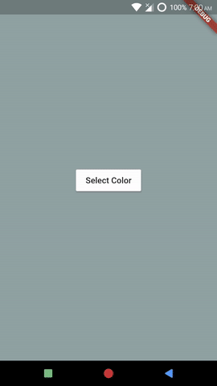

# SearchField, SearchingIndicator, and SearchBar Components
*Example: 2_intermediate_02*

<!-- TODO add reference to docs -->


## Code Highlights

```dart
import 'package:selection_menu/selection_menu.dart';
import 'package:selection_menu/components_configurations.dart';

SelectionMenu<FlatColor>(
    componentsConfiguration:
        DialogComponentsConfiguration<FlatColor>().copyWith(
      searchFieldComponent:
          SearchFieldComponent(builder: _searchFieldBuilder),
      // Builds the widget where the user enters search text

      searchingIndicatorComponent:
          SearchingIndicatorComponent(builder: _searchingIndicatorBuilder),
      // Builds the widget that indicates search in progress.

      searchBarComponent: SearchBarComponent(builder: _searchBarBuilder),
      // Builds a widget (Search Bar) that typically contains
      // Search Field and Searching Indicator. 
    ),
    itemSearchMatcher: _itemSearchMatcherCallback,
    // This method is needed. 
    // null means that search is disabled.
    // This behavior can be changed by MenuComponent. However, it is 
    // true for the 2 predefined ones.
    
    // Other Properties...
  );
```

For complete code, explained with details, see [main.dart](./main.dart).
## Result

