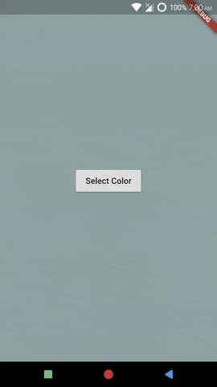

# ListViewComponent and MenuComponent
*Example: 2_intermediate_03*

<!-- TODO add reference to docs -->


## Code Highlights

```dart
import 'package:selection_menu/selection_menu.dart';
import 'package:selection_menu/components_configurations.dart';

SelectionMenu<FlatColor>(
    componentsConfiguration:
        DialogComponentsConfiguration<FlatColor>().copyWith(
      listViewComponent: ListViewComponent(builder: _listViewBuilder),
      // A Component that builds the scrollable list in which items are 
      // shown.

      menuComponent: MenuComponent(builder: _menuBuilder),
      // A Component that combines SearchBar and ListView.
      // Much like how SearchBar combines SearchField and Searching 
      // Indicator.
    ),
    // TODO API Ref
  );


```

For complete code, explained with details, see [main.dart](./main.dart).
## Result

