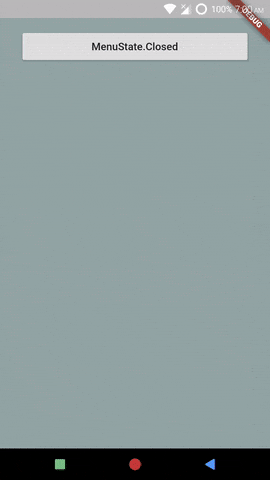

# Accessing MenuState and Selected Item
*Example: 2_intermediate_05*

<!-- TODO add reference to docs -->


## Code Highlights

```dart
import 'package:selection_menu/selection_menu.dart';
import 'package:selection_menu/components_configurations.dart';

class MyTriggerComponent extends TriggerComponent
{
  MyTriggerComponent()
  {
    super.builder = _builder;
  }
  
  Widget _builder(TriggerComponentData data)
  {
    doSomethingWithItem(data.selectedItem as FlatColor);
    doSomethingWithMenuState(data.menuState);
    // ...
  }
}
// ...
```

For complete code, explained with details, see [main.dart](./main.dart).
## Result

