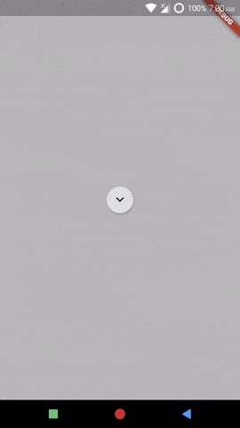

# AnimationComponent and MenuPositionAndSizeComponent
*Example: 3_advance_01*

<!-- TODO add reference to docs -->


## Code Highlights

```dart
import 'package:selection_menu/selection_menu.dart';
import 'package:selection_menu/components_configurations.dart';

class MyAnimationComponent extends AnimationComponent
    with ComponentLifeCycleMixin // To get hooks to the Menu's lifecycle
{
  AnimationController _animationController;
  Animation<double> _animation;

  MyAnimationComponent() {
    super.builder = _builder;
  }
  MenuState _lastState;
  Widget _builder(AnimationComponentData data) {
    if (_animationController == null) {
      _animationController = AnimationController(
          vsync: data.tickerProvider,
          duration: data.menuAnimationDurations.forward,
          reverseDuration: data.menuAnimationDurations.reverse);

      _animation = CurvedAnimation(
        parent: _animationController,
        curve: Curves.elasticOut,
      );

      // Add a listener to know when animation stops.
      // Since you need to explicit report to the widget that the animation
      // state has changed.
      _animation.addStatusListener((status) {
        if (status == AnimationStatus.dismissed ||
            status == AnimationStatus.completed) {
          if (_lastState == MenuState.OpeningEnd) {
            // To tell the widget that menu has opened
            data.opened();
          } else {
            // to tell the widget that the menu has closed.
            data.closed();
          }
        }
      });
    }

    switch (data.menuState) {
      case MenuState.OpeningStart:
        // Widget is first built for this state.
        //
        // When using Implicit Animations, define widgets with starting
        // configurations at this point.
        //
        // like :
        // AnimatedContainer(color: Colors.transparent,);

        break;
      case MenuState.OpeningEnd:
        // Widget is built for this state Immediately after OpeningStart state.
        //
        // When using Implicit Animation, define widgets with ending configurations
        // at this point.
        // Since implicit animations don't typically have status listeners,
        // you may use data.willOpenAfter(Duration);
        //
        // like :
        // AnimatedContainer(color: Colors.black,);
        //
        // For explicit animations start animation like so:
        _animationController.forward();
        _lastState = data.menuState;
        break;
      case MenuState.Opened:
        // Widget is not built for this state.
        break;
      case MenuState.ClosingStart:
        // Just like to OpeningStart.
        break;
      case MenuState.ClosingEnd:
        // Just like OpeningEnd.
        //
        // you can use data.willCloseAfter(Duration); for implicit animations.
        _animationController.reverse();
        _lastState = data.menuState;
        break;
      case MenuState.Closed:
        // Widget is not built for this state.
        break;
    }

    return AnimatedBuilder(
      // ...
    );
  }

  @override
  void dispose() {
    if (_animationController != null) {
      _animationController.dispose();
      _animationController = null;
    }
  }

  @override
  void init() {
    _animationController = null;
  }
}

  MenuPositionAndSize _menuSizeAndPositionBuilder(
      MenuPositionAndSizeComponentData data) {
    double menuMidY = data.constraints.biggest.height / 2;
    double menuMidX = data.constraints.biggest.width / 2;

    // The origin of the menu is top-left corner. Which matches the top-left corner
    // of the button. -menuMidY and -menuMidX offset makes the menu middle meet
    // the top-left corner of the button. We add half of the button lengths so
    // that the menu middle and button middle become the same.
    double offsetY = -menuMidY + data.triggerPositionAndSize.size.height / 2;
    double offsetX = -menuMidX + data.triggerPositionAndSize.size.width / 2;

    return MenuPositionAndSize(
      constraints: BoxConstraints.tight(data.constraints.biggest),
      // To ensure that the calculated middle stays the middle, we have to
      // fix the Size of the menu, hence new BoxConstraints are tight to the
      // biggest Size possible.
      positionOffset: Offset(offsetX, offsetY),
    );
  }
// ...
```

For complete code, explained with details, see [main.dart](./main.dart).
## Result

